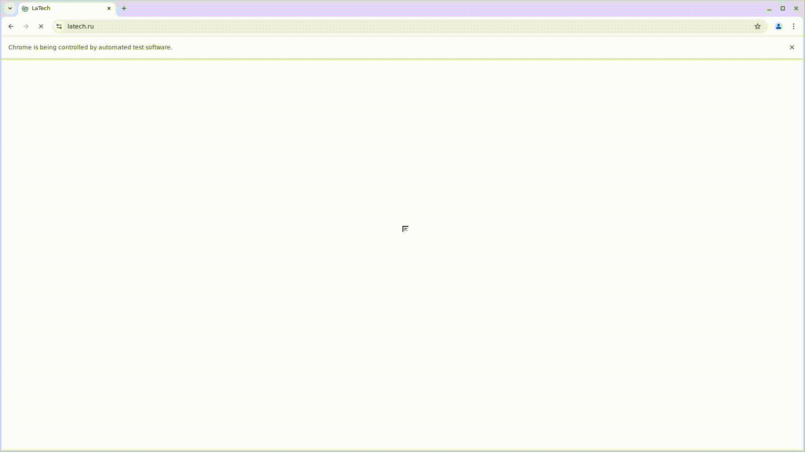
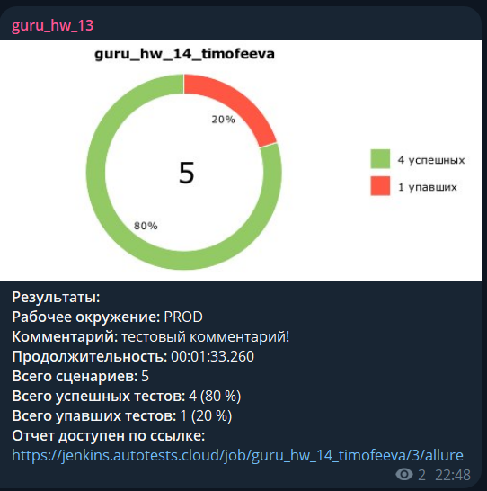
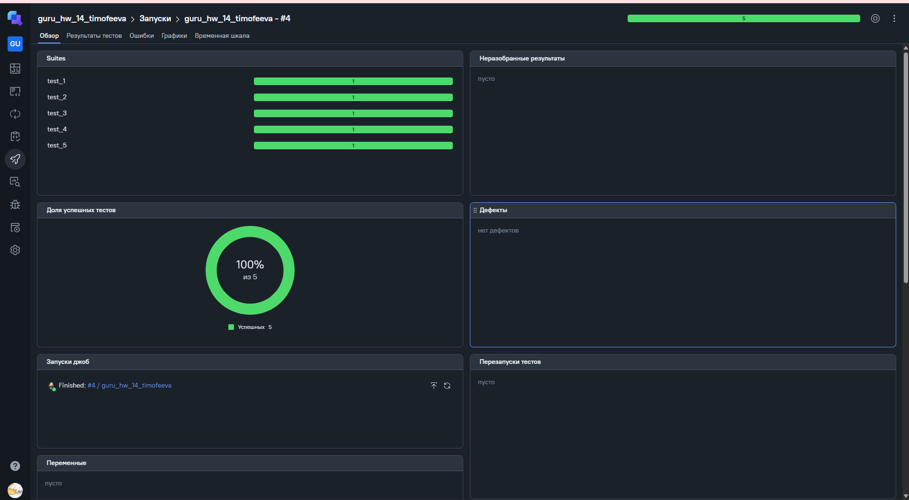
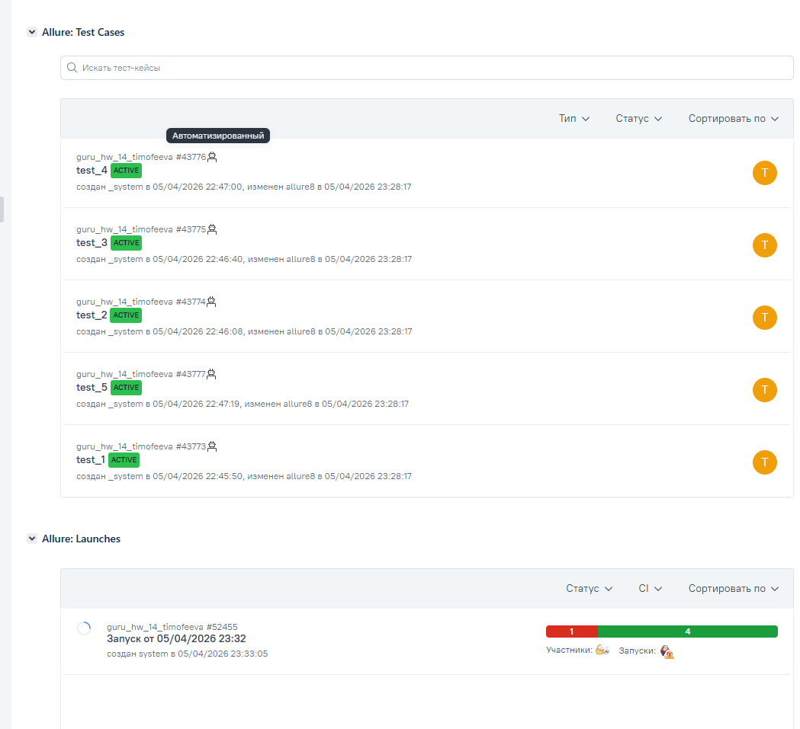

# Автотесты для сайта latech.ru

## Содержание
- [Технологии и инструменты](#технологии-и-инструменты)
- [Структура проекта](#структура-проекта)
- [Тест-кейсы](#тест-кейсы)
- [Установка и запуск](#установка-и-запуск)
- [Запуск в CI/CD](#запуск-в-cicd)
- [Allure отчёт](#allure-отчёт)
- [Уведомления в Telegram](#уведомления-в-telegram)
- [Интеграция с Allure TestOps](#интеграция-с-allure-testops)
- [Интеграция с Jira](#интеграция-с-jira)

---

## Технологии и инструменты


## Структура проекта

```
├── pages/
│   ├── base_page.py      # базовые методы (клики, ожидания, assert'ы)
│   └── main_page.py      # локаторы и методы главной страницы
├── tests/
│   ├── test_1.py         # прокрутка к блоку "Наши проекты"
│   ├── test_2.py         # переход на страницу "О компании"
│   ├── test_3.py         # кнопка "Все вакансии Lamoda"
│   ├── test_4.py         # клик на логотип latech
│   └── test_5.py         # реквизиты компании в футере
├── images_md/            # скриншоты и GIF для README
├── logs/                 # логи тестов
├── attach.py             # аттачменты для Allure
├── conftest.py           # фикстуры и конфигурация
├── pytest.ini            # конфигурация pytest и Allure
└── requirements.txt      # зависимости
```

## Тест-кейсы

| Тест | Описание | Severity |
|------|----------|----------|
| test_1 | Проверка автоматической прокрутки к соответствующему блоку после нажатия на кнопку "Наши проекты" | Critical |
| test_2 | Переход к странице "О компании" и проверка URL | Critical |
| test_3 | Проверка кнопки "Все вакансии Lamoda" | Critical |
| test_4 | Клик на логотип latech возвращает на главную страницу | Normal |
| test_5 | Проверка наличия реквизитов компании в футере страницы | Normal |

## Установка и запуск

### Установка зависимостей

```bash
pip install -r requirements.txt
```

### Запуск всех тестов
```bash
pytest
```
> Параметры `--alluredir` и `--clean-alluredir` заданы в `pytest.ini` и применяются автоматически.

### Запуск конкретного теста

```bash
pytest tests/test_1.py 
```

### Просмотр Allure отчёта

```bash
allure serve allure-results
```

## Запуск в CI/CD

Тесты запускаются через **Jenkins** вручную.  
Браузер поднимается удалённо через **Selenoid** с включённой записью видео и VNC.

## Allure отчёт

Каждый тест содержит следующие аттачменты:
- 📸 Скриншот
  
- 📄 Исходный код страницы
- 📋 Логи браузера
- 🎥 Запись видео выполнения теста
  

## Уведомления в Telegram

После завершения запуска в Jenkins автоматически отправляется уведомление в Telegram с результатами тестов.

Уведомление содержит:
- 📊 Диаграмму с результатами
- ✅ Количество успешных тестов
- ❌ Количество упавших тестов
- ⏱ Продолжительность запуска
- 🔗 Ссылку на Allure отчёт



## Интеграция с Allure TestOps

В Allure TestOps хранится тест-план с ручными и автоматизированными тестами.  
Результаты автозапусков из Jenkins автоматически отображаются в Allure TestOps.



## Интеграция с Jira

Тест-кейсы и результаты запусков связаны с задачами в Jira.  
Из каждой задачи можно перейти к связанным тестам и результатам их выполнения.


